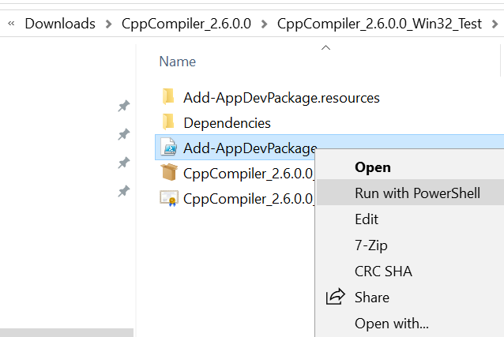

Universal Windows Platform (UWP) app to compile C/C++
=====================================================

Sister app for use with our [DevMax C/C++ IDE](https://www.microsoft.com/en-us/store/p/devmax/9mzqlt5d5b39).

This application uses code from LLVM, Clang and LLD. See the included [LLVM License](LLVM_LICENSE.md) for the library licensing terms. Note that we only distribute the application binary.

Installation Instruction
------------------------

There are 3 required steps and 1 optional step:

  1. Download and install [Microsoft Visual C++ 2017 Redistributable](https://support.microsoft.com/en-us/help/2977003/the-latest-supported-visual-c-downloads) from Microsoft Support website. (If you already have it on your machine, you don't need to do this step.)
  2. Enable developer mode on your machine in __All settings > Update & Security > For developers__.
     
  3. Download our app release package from [our release page](https://github.com/light-tech/UniversalCppCompiler/releases) such as `CppCompiler_2.6.0.0.7z`. Extract it with [7-zip](https://www.7-zip.org/), open the extracted folder, right click on the PowerShell script `Add-AppDevPackage.ps1` and select `Run with PowerShell`.
     
  4. (__Optional__) If you only want to use the C/C++ interpreter, you do not need to get all Microsoft's C/C++ headers (i.e. those standard C `stdio.h`, `stdlib.h`, ... or Microsoft SDK `windows.h`) and libraries. If you want to __compile__ your programs into executable (i.e. `.exe` files), you need to obtain and copy them to the correct places.

Examples
--------

Head over to [our repository](https://github.com/light-tech/DevMaxGettingStarted) to learn how to get started using DevMax C/C++ interpreter.

You can learn more about software development with [our path processing library example](https://github.com/light-tech/DevMaxPathLibrary) or a [more complicated software](https://github.com/light-tech/DevMaxGeometry) to do computations in geometry. (We are still in progress of writing these examples. Any input is welcome.)

Happy Coding!